<b>🇺🇸 English</b>

 

### Hi, I'm Guzmán 👋

Computer Science technologist student · Montevideo, Uruguay 
I build web projects and ship them to production.

🌐 [wusman.com](https://wusman.com) · 💼 [LinkedIn](https://www.linkedin.com/in/wusman19/) · 📫 contact@wusman.com

**Projects**

**[wusman.com](https://github.com/Wusman/wusman.com)** — interactive portfolio with a built-in word-search game.

**[daily-arena](https://github.com/Wusman/daily-arena)** — verifiable daily minigame arena with a biweekly ranking. Deterministic puzzles (same seed for everyone) and server-side anti-cheat via replay.

**[mistica-futbolera](https://github.com/Wusman/mistica-futbolera)** — 100% client-side game: draft your dream team of European football legends (1993–2025) and win the tournament.

<b>🇺🇾 Español</b>

 

### Hola, soy Guzmán 👋

Estudiante de Tecnólogo en Informática · Montevideo, Uruguay 
Construyo proyectos web y los pongo en producción.

🌐 [wusman.com](https://wusman.com) · 💼 [LinkedIn](https://www.linkedin.com/in/wusman19/) · 📫 contact@wusman.com

**Proyectos**

**[wusman.com](https://github.com/Wusman/wusman.com)** — portfolio interactivo.

**[daily-arena](https://github.com/Wusman/daily-arena)** — arena de minijuegos diarios verificables, con ranking quincenal. Puzzles deterministas (misma semilla para todos) y anti-trampa server-side por replay.

**[mistica-futbolera](https://github.com/Wusman/mistica-futbolera)** — juego 100% client-side: armá tu equipo de leyendas del fútbol europeo (1993–2025) y salí a ganar el torneo.

---

### 🛠️ Stack

---

### 📊 GitHub Stats

  
  

